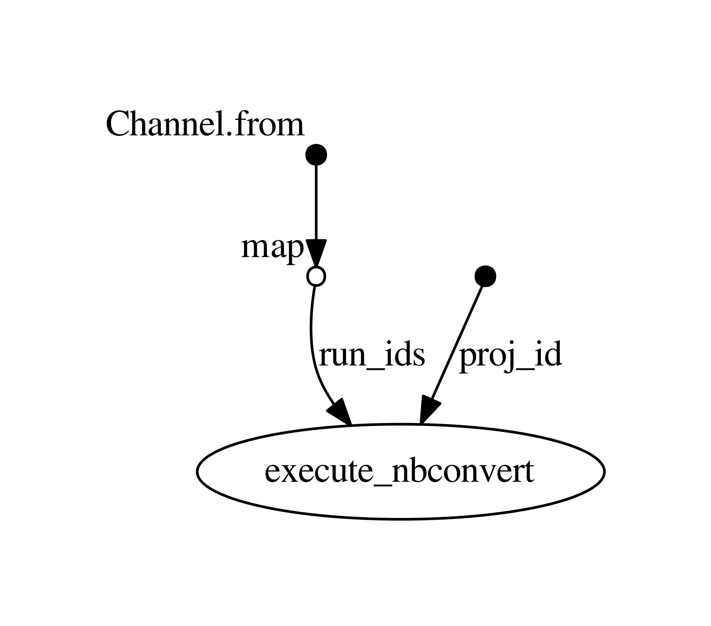

# RamDAQ-prototype is discontinued. Please use [ramdaq](https://github.com/rikenbit/ramdaq) instead!

RamDAQ is a computational pipeline for quality control (QC) of RamDA-seq experiments.

RamDA-seq is a single-cell total RNA sequencing method. Publication is [here](https://doi.org/10.1038/s41467-018-02866-0). The detailed protocol is [here](https://bit.riken.jp/protocols/ramda-seq/) and [kit is available from Toyobo](https://www.toyobo-global.com/news/2019/release_105.html).

RamDAQ excutes preprocessing and analysis steps on RamDA-seq data and generates a QC report (See this [example](https://nbviewer.jupyter.org/github/rikenbit/RamDAQ/blob/master/examples/RamDAQ_report_SE_humanNSC_sample.ipynb)).


## Requirements
- [Nextflow](https://www.nextflow.io/)
- [Docker](https://www.docker.com/)

## Getting started
### 1. Installing Nextflow
1. Make sure 8 or later is installed on your computer by using the command: `java -version`
2. Enter the below commands in your terminal (The command creates a file nextflow in `~/bin`)
```
mkdir -p ~/bin
cd ~/bin
wget -qO- https://get.nextflow.io | bash
```

3. Run the classic Hello world by entering the following command: `~/bin/nextflow run hello`

### 2. Installing Docker
- For Mac and Windows users: Download installer from [here](https://docs.docker.com/install/#supported-platforms).
- For Linux users: Follow instructions for your platforms [here](https://docs.docker.com/install/#supported-platforms).

### 3. Clone this repository

```
cd
git clone https://github.com/rikenbit/RamDAQ.git
```

### 4. Downloading example FASTQ files
```
cd $HOME/RamDAQ/examples/download_fastq_files
~/bin/nextflow run download-fastq.nf -c download-fastq.config
mkdir -p $HOME/RamDAQ_example/output_RamDA_human_NSC/human_NSC_001
mv output_download_fastq $HOME/RamDAQ_example/output_RamDA_human_NSC/human_NSC_001/01_fastq_files
```

For more information, see [here](examples/download_fastq_files).

### 5. Preparing annotation files
See [Preparing human annotation files](tutorials/Preparing_human_annotation_files.md)

### 6. Modifying config file

First, copy config file to the directory.
```
cd $HOME/RamDAQ_example

cp $HOME/RamDAQ/QC_config/RamDAQ_execute_local.config .
cp $HOME/RamDAQ/QC_config/RamDAQ_annot_human.config .
cp $HOME/RamDAQ/QC_config/RamDAQ_unstranded_SE.config .
cp $HOME/RamDAQ/QC_config/sample/RamDAQ_human_unstranded_SE.config .
```

Then, modify `RamDAQ_human_unstranded_SE.config` using your favorite editors as follows:

```
project_id = "RamDA_human_NSC"
```
```
run_ids = [
            ["human_NSC_001"]
	    ]
```
```
maxReadLength = 50
minReadLength = 36
```

### 7. Running RamDAQ basic pipeline


```
cd $HOME/RamDAQ_example

~/bin/nextflow run ~/RamDAQ/QC_SE/RamDAQ_SE.nf -c RamDAQ_human_unstranded_SE.config \
    -resume -with-report log.RamDAQ_SE.html
```

Finally, you can get a QC report in html format under
 `$HOME/RamDAQ_example/output_RamDA_human_NSC/human_NSC_001/${run_id}_notebook_SE_unstranded.html`.


## Usage
### 1. Preparing annotation files
- For human data, see [Preparing human annotation files](tutorials/Preparing_human_annotation_files.md)
- For mouse data, see [Preparing mouse annotation files](tutorials/Preparing_mouse_annotation_files.md)

### 2. Preparing input FASTQ files

- Naming convention: The extensions must be `.fastq.gz`.
- FASTQ files must be located in a single directory: `your_favorite_path/output_${project_id}/${run_id}/01_fastq_files` (*`your_favorite_path` can be any path!*)

#### 2-1. For PE data
For PE FASTQ files, there exist various file naming conventions (e.g., `*_R1.fastq.gz` or `*.R1.fastq.gz`), making it difficult to parse file names. To avoid this diffucluty, users need to prepare a TSV-formatted file called 'PE_samplelist.txt' (In the confing PE data, you will see `fastq_filelist = 'PE_samplelist.txt'`). The 'PE_samplelist.txt' is a TSV-formatted file with a header line consists of three columns (Sample_ID, Fastq1, Fastq2) and contains a FASTQ file pair (Read1 and Read2) in each line. See [example](QC_config/PE_samplelist.txt).


#### Converting FASTQ files from a BCL file
See [tutorial on bcl2fastq](tutorials/bcl2fastq.md).

### 3. Modifying config file
The following section in `*.config` file should be changed.

- `project_id`: (string)
- `run_ids`: (string)
- `maxReadLength`: (int) Maximum read length to be retaiend after read trimming.
    - Note: For Illumina sequencer data, the last nucleotide of sequenced read  (In practice, if read length of your FASTQ file is 51, 76, or 101, you should set `maxReadLength` to 50, 75, or 10, respectively)
- `minReadLength`: (int) Minimum read length to be retaiend after read trimming. We recommend to use the half of `readLength`.


### 4-1. Running RamDAQ basic pipeline on single-end (SE) data

```
# Move to the directory where your FASTQ files are contained in `your_favorite_path/output_${project_id}/${run_id}/01_fastq_files`
cd your_favorite_path

# Copy a config file (The example here is in case of SE)
cp $HOME/RamDAQ/QC_config/RamDAQ_execute_local.config .
cp $HOME/RamDAQ/QC_config/RamDAQ_annot_human.config .
cp $HOME/RamDAQ/QC_config/RamDAQ_unstranded_SE.config .
cp $HOME/RamDAQ/QC_config/sample/RamDAQ_human_unstranded_SE.config .

# Modify `RamDAQ_human_unstranded_SE.config` (See instruction above)

# Run RamDAQ pipeline
~/bin/nextflow run ~/RamDAQ/QC_SE/RamDAQ_SE.nf -c RamDAQ_human_unstranded_SE.config \
    -resume -with-report log.RamDAQ_SE.html
```

The output files are save in `your_favorite_path/output_${project_id}`.

### 4-2. Running RamDAQ basic pipeline on paired-end (PE) data

```
# Make a directory with your favorite name
mkdir your_favorite_path

# Move into the directory
cd your_favorite_path

# Copy a config file (The example here is in case of PE)
cp $HOME/RamDAQ/QC_config/RamDAQ_execute_local.config .
cp $HOME/RamDAQ/QC_config/RamDAQ_annot_human.config .
cp $HOME/RamDAQ/QC_config/RamDAQ_unstranded_PE.config .
cp $HOME/RamDAQ/QC_config/sample/RamDAQ_human_unstranded_PE.config .
cp $HOME/RamDAQ/QC_config/PE_samplelist.txt .

# Modify `RamDAQ_human_unstranded_PE.config` (See instruction above)

# Modify `./PE_samplelist.txt` (See instruction above)

# Run RamDAQ pipeline
~/bin/nextflow run ~/RamDAQ/QC_PE/RamDAQ_PE.nf -c RamDAQ_human_unstranded_PE.config \
    -resume -with-report log.RamDAQ_PE.html
```

The output files are save in `your_favorite_path/output_${project_id}`.

### Exclude 'blacklist' cells/samples from notebook reports (Optional)
If you'd like to exclude some uninterested cells/samples (e.g., RT(-) cells or blanks samples) from notebook reports, all you need is to prepare a text file named `exclude_samplelist.txt` under the `${run_id}/` directory.

`exclude_samplelist.txt` is a list of cell/sample names to be excluded from notebook reports, where each line contains one cell/sample name/id.

## What occurs in RamDAQ pipeline
### RamDAQ basic pipeline

1. Read trimming (fastq-mcf)
    - 
2. Read mapping (HISAT2)
    - 
3. Expression level quantification (featureCounts)
    - 
4. Automatic reporting (Jupyter notebook)
    - 

### RamDAQ optional pipelines

- FASTQ file generation (bcl2fastq)
    - 
- Expression level quantification (Sailfish)
    - 
- High sensitivity rRNA quantification (HISAT2, featureCounts)
    - 
    - What is 'High sensitivity rRNA mapping' ?: See [here](/tutorials/High_sensitivity_rRNA_quantification.md)

## Computational time and resource usage
- Machine: Linux-x64 / 24 CPU / Memory 660 GB
- Data: RamDA-seq data (n=96) on human neural stem cells (NSC)
    - 1,999,153 reads/cell, 51 nt SE, GC% 44.56
- Computational time
    - 02_ramdaQC_SE_fastqmcf_fastQC: 5m 39s
    - 03_ramdaQC_SE_hisat2: 25m 34s
    - 04_ramdaQC_SE_RSeQC: 10h 22m 7s
        - In this example 1 file takes 3hours, you can estimate this process by CPU number.
    - 06_ramdaQC_SE_featurecounts: 7m 49s
 - Memory usage
    - up to ~6 GB
 - Storage
    - around 300GB

## Contact
- Issues
- Email: support-bit (at) riken (dot) jp

## Maintainers
- Mika Yoshimura
- Haruka Ozaki
